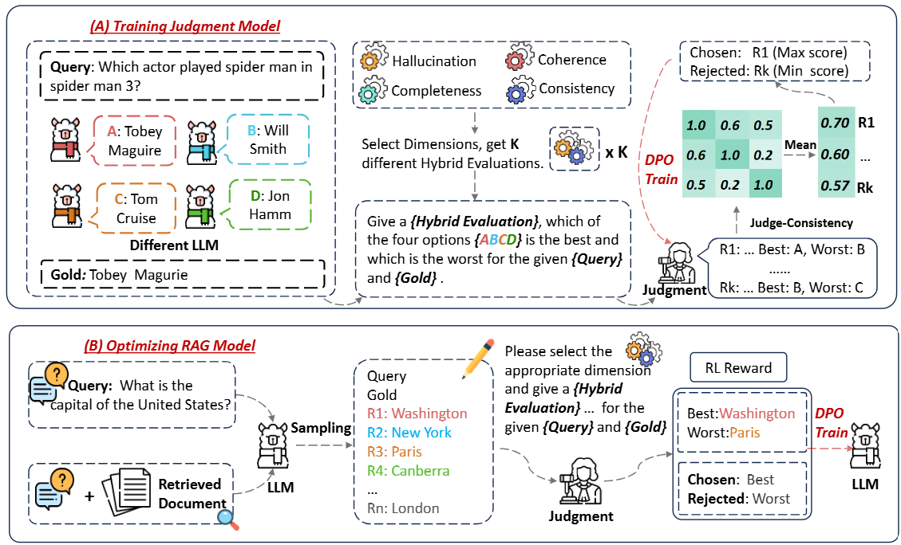

# ConsJudge
Source code for paper: Judge as A Judge: Improving the Evaluation of Retrieval-Augmented Generation through the Judge-Consistency of Large Language Models

## Overview

ConsJudge is a method that enhances LLM-based judgment models to generate more accurate evaluations for RAG models in a self-improvement framework. ConsJudge incorporates specialized evaluation dimensions and employs a multiple-choice selection strategy for evaluation modeling.



## Requirements

### 1. Requirement.
**Install the following packages using Pip or Conda under this environment**

```
Python==3.10.14
torch==2.2.1
transformers==4.40.0
faiss==1.8.0
tqdm
trl==0.8.6
vllm==0.4.1
accelerate==0.30.1
deepspeed==0.14.2
peft==0.10.0
```
### 2. Install LLaMA-Factory.
Refer to [https://github.com/hiyouga/LLaMA-Factory](https://github.com/hiyouga/LLaMA-Factory) for detailed instructions.

```bash
git clone --depth 1 https://github.com/hiyouga/LLaMA-Factory.git
cd LLaMA-Factory
pip install -e ".[torch,metrics]"
```

## Train Judgment Model

### 1. Data Preparation.
In order to construct the train dataset for Judgment model, you can follow Table 5 in the paper to collect the corresponding dataset and process the data into the following jsonl format and put the data into the ``data/ConsJudge_train`` folder. Besides, you can also collect more datasets on your own and process them for training.
```
{
  'question': str # The question of data.
  'answer': str # The ground truth of data.
  'content': str # The context of data, if available.
}
```
After that, you can construt multiple choices data using different LLMs or download the data directly from [here](https://huggingface.co/datasets/sanwuge/ConsJudge_train). You can also use other methods to construct multiple choices to increase diversity. The more diverse the choices, the better the effect.

```
cd script
bash choices_gen.sh
python ../src/ConsJudge_train/construct.py
```
Then, you can synthesize train data using vanilla LLMs and [MiniCPM-Embedding](https://huggingface.co/openbmb/MiniCPM-Embedding) model.
```
bash construct_ConsJudge_data.sh
```
### 2. Train Model.
You can train Judgment model by utilizing LLaMA-Factory framework quickly, we provide the yaml files. Please refer to LLaMA-Factory for relevant environment installation and configuration.
```
cd LLaMA-Factory
```
You can also download the checkpoint of [qwen2.5-14B](https://huggingface.co/sanwuge/ConsJudge-qwen) and [llama3-8B](https://huggingface.co/sanwuge/ConsJudge-llama) directly.

## Train RAG Model
### 1. Prepare the train/dev data.
In order to construct the train/dev dataset for RAG model training, you need to follow [https://github.com/OpenMatch/RAG-DDR](https://github.com/OpenMatch/RAG-DDR). You can follow Table 5 in the paper to collect the corresponding dataset and retrieve relevant documents and generate DPO sampling data based on the vanilla RAG model. Then you should process the data into the following jsonl format:
```
{
  'question': str # The question of data.
  'answer': str # The ground truth of data.
  'passage': array # The retrieved passages of data.
  'raw_response': array # The answer without utilizing relevant passages.
  'aug_response': array # The answer utilizes all relevant documents.
}
```
For AQUA-RAT, ECQA, StrategyQA, Web_Questions datasets, you need to further process the data.
```
cd src/RAG_train
python preprocess_acc_data.py
```
Finally, you can obtain four original data files in folder``data/RAG_train``. You can also download the original data directly form [here](https://huggingface.co/datasets/sanwuge/RAG_train).
### 2. Construct DPO data using Judgment Model.
You need to first use Judgment Model to build a higher quality DPO dataset.
```
cd script
bash construct_RAG_rouge_data.sh
bash construct_RAG_acc_data.sh
```
Then, merge processed data files into train.jsonl and dev.jsonl respectively.
### 3. Train Model.
```
bash RAGmdoel_train.sh
python ../src/RAG_train/merge_lora.py
```
## Evaluation
### 1. Prepare the test data.
For constructing the test data, you can download KILT's test dataset from [here](https://github.com/facebookresearch/KILT) and select the corresponding test dataset from KILT according to Table 1 in the paper. After that, you can retrieve the relevant documents for each test dataset. Please refer to [https://github.com/OpenMatch/RAG-DDR](https://github.com/OpenMatch/RAG-DDR) for more details. You should put test data in folder ``data/evaluation``. You can also download the test data directly form [here](https://huggingface.co/datasets/sanwuge/evaluation).

### 2. Evaluation.
For NQ, Hotpotqa, TriviaQA datasets:
```
cd script
bash eval_nq.sh
```
For ASQA dataset, you should save the output, so modify save path in ``src/evaluation/eval.py``:
```
bash eval_asqa.sh
python ../src/evaluation/postprocess.py
python ../src/evaluation/calculate_em_recall.py
```
For MARCO QA and WoW datasets, you should save the output, so modify save path in ``src/evaluation/eval.py``:
```
bash eval_marco.sh
python ../src/evaluation/postprocess.py
python ../src/evaluation/LLM_eval.py
```


## Contact

If you have questions, suggestions, and bug reports, please email:
```
2472026@stu.neu.edu.cn
```